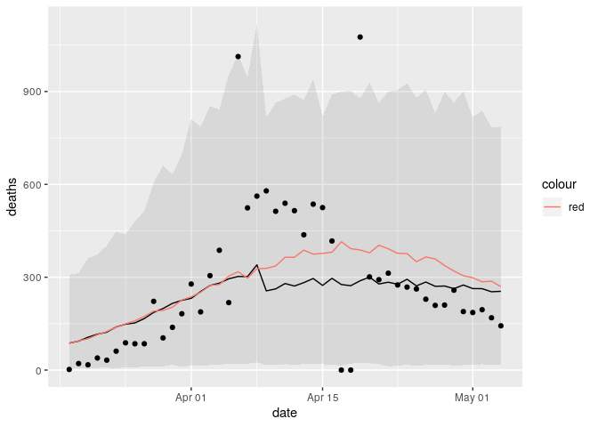
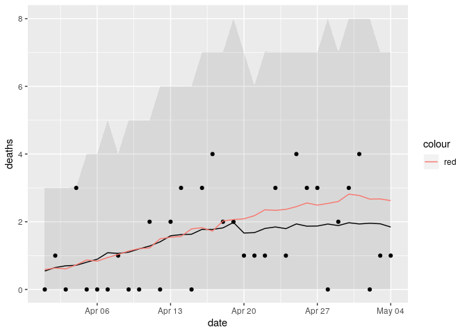

It is clear that lockdown has mitigated the spread of the 2019 novel
coronavirus, but there is no certainty by how much. During the first
wave of Covid-19 there was an immediate need for models to determine the
potential extent of the spread with stay at home orders in place. Now
that we are leaving the first peak behind us, the priority of policy
makers and modelers in the US has shifted towards quantifying the effect
of lifting restrictions to maintain the epidemic’s second wave under
control. Understanding the anatomy of mobility in each US county and
measuring the real (causal) effect of lockdown and other interventions
on Covid-19 spread is key in guiding quick responses and identifying
their risk while reopening the economy during this pandemic and others
that might come.

Train model
-----------

A preliminary version of a (bayesian hierarchical) model is trained
where the intervention (stay at home order) is a dummy varible.

The rstan code looks like this

    deaths_model = stan_glmer.nb(
      deaths ~
        poly(days_since_thresh, 2) * (intervention) +
        (poly(days_since_thresh, 2) | fips),
      offset = log(pop), 
      data=county_features, 
      algorithm = "meanfield")

The model formulation looks like this

$$ \\begin{aligned} y\_{it} & (*{it}, r) \\ *{it} & = *{i0} +*{i1}t +
\_{i2} t^2 + N\_i \\ \[*{i0}, *{i1}, \_{i2}\]^&N(, ) \\

\\end{aligned} $$

Generate counterfactual
-----------------------

Let’s generate the inference and the counterfactual (what would have
happened if the intervention never existed).

    deaths_model <- readRDS("./deaths_model.rds")

    ## Generate inference
    ypost <- posterior_predict(deaths_model, 
                               newdata = select(county_features, 
                                                days_since_thresh,
                                                fips,
                                                pop,
                                                intervention))

    county_features %<>% 
      mutate(
        ymu = apply(ypost, 2, mean),
        ymed = apply(ypost, 2, quantile, probs = 0.5), # use posterior median to hand skewness
        ylo = apply(ypost, 2, quantile, probs = 0.025),
        yhi = apply(ypost, 2, quantile, probs = 0.975)) 

    ## Generate prediction

    county_features$intervention <- 0

    ypost <- posterior_predict(deaths_model, 
                               newdata = select(county_features, 
                                                days_since_thresh,
                                                fips,
                                                pop,
                                                intervention))

    county_features %<>% 
      mutate(
        ymu_0 = apply(ypost, 2, mean),
        ymed_0 = apply(ypost, 2, quantile, probs = 0.5), # use posterior median to hand skewness
        ylo_0 = apply(ypost, 2, quantile, probs = 0.025),
        yhi_0 = apply(ypost, 2, quantile, probs = 0.975)) 

Effect of intervention
----------------------

This is a preliminary result of the effect of the intervention (stay at
home) in New York City.

The black line is the inference of the number of deaths with
intervention, The red line is the counterfactual.

    ## plot
    county_features %>%
      filter(fips == 36061) %>%
      ggplot() +
      geom_ribbon(aes(x=date,
                      ymin= ylo,
                      ymax= yhi), alpha= 0.1) +
      geom_point(aes(x=date, y= deaths)) +
      geom_line(aes(x=date,
                    y=ymu)) +
      geom_line(aes(x=date,
                    y=ymu_0, col = "red"))

Let’s see the the preliminary result for Austin Texas.

    ## plot
    county_features %>%
      filter(fips == 48453) %>%
      ggplot() +
      geom_ribbon(aes(x=date,
                      ymin= ylo,
                      ymax= yhi), alpha= 0.1) +
      geom_point(aes(x=date, y= deaths)) +
      geom_line(aes(x=date,
                    y=ymu)) +
      geom_line(aes(x=date,
                    y=ymu_0, col = "red"))

The difference between the red and blak line is the effect of the stay
at home intervention.
