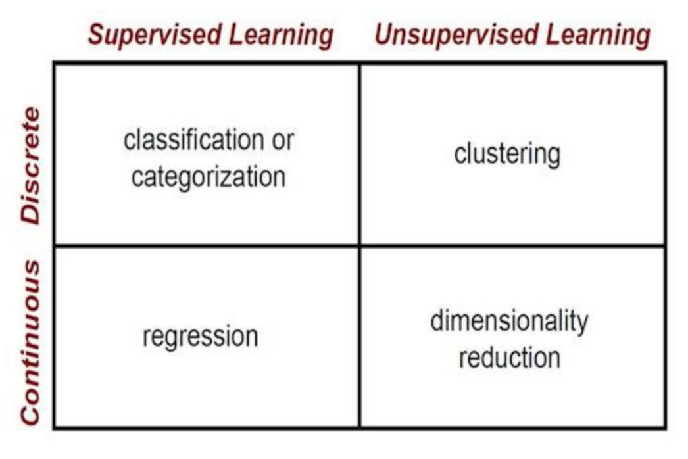

# springboard_ml

41 Essential Machine Learning Interview Questions from Springboard [https://www.springboard.com/blog/machine-learning-interview-questions/](https://www.springboard.com/blog/machine-learning-interview-questions/)

**key words**: algorithm, instances, satisfy the condition, guesses, training error, optimistically biased, pessimistically biased, generalization, decision rule

## Question 1: What’s the trade-off between bias and variance?

We use the bias variance trade-off **to understand if a model generalizes well** in unseen data. A model that is either too complex or too simple might not generalize well.

 **Bias-variance / dartboard** : imagine you have two people throwing darts. The first person throws ten darts and all the darts hit an area far from the target but are very close from each other. This throwers aim is very biased and has little variance. The second thrower hits the target once but the other nine darts are spread all over the dart board. The second thrower's aim has a lot of variance but it's not biased.     

In modeling, in lots of cases, the output is an estimate of something. In order for this estimate to be good, it should be close to the real value of the thing we're trying to model. During the modeling process, the idea of bias-variance trade off **helps us assess how to make decisions** and get more -a model that generalizes well- reliable estimates.

When the training set is too large, or we are using too many variables, we have reason to believe that we are **overfitting** and therefore our estimates will have a lot of variance once we the input a different dataset.

When the training set is too small, or we are not using enough covariates, what could happen is that we are **underfitting** and our estimates are too far away from the target values and that would mean that they are unbiased.

Interestingly enough, with deep learning modeling, there can be high-bias high-variance estimators as well as low-bias low-variance estimators (which are most desirable estimators).

- [x] Andrew Ng's explanation of bias variance trade-off [https://www.youtube.com/watch?v=SjQyLhQIXSM](https://www.youtube.com/watch?v=SjQyLhQIXSM)

## Question 2: What is the difference between supervised and unsupervised learning?

**Supervised learning** covers methods where there is a set of known labels or values that we want to obtain by learning **their relationship with other variables**. Examples of supervised learning are regression and classification.

**Unsupervised methods** **look for patterns** or the **natural structure** that help us describe a population. Unsupervised learning is very useful in exploratory analysis because it can automatically identify structure in data. Examples of unsupervised learning methods are clustering, dimensionality reduction and density estimation.

**Representation Learning** word2vec, neural networks

- [x] Towards Data Science post on superset and unsupervised learning [https://towardsdatascience.com/supervised-vs-unsupervised-learning-14f68e32ea8d](https://towardsdatascience.com/supervised-vs-unsupervised-learning-14f68e32ea8d)

## Question 3: What is the difference between k-nn and k-means?

**K-nn** is a simple supervised algorithm. Because it is supervised it can be used for classification or regression:

As a classifier it works like a **class membership**. A given point is classified by a **plurality vote** of its k nearest neighbors. 

As a regressor the output of a given point is **the average of the output labels** of its k nearest neighbors.

It is commonly used to **benchmark** other models but because it is instance-based (it "memorizes" and uses all its training datapoints) and that comes with a cost, it is uses a lot of memory.

It can also work for imputation of missing data. They would be a good choice for problems that have graph structured data. For example an application could be recommendation systems in social graphs.

If k=1 then we would be overfitting and would have a lot of flexibility, that is a low-bias high-variance estimator
If k is too big, the **decision curve** is smoother and we get a high-bias low-variance estimator.

Drawback: **curse of dimensionality** therefore it is desirable to use dimensionality reduction first.

To determine the k use cross-validation k-fold cross validation.

- [x] [https://kevinzakka.github.io/2016/07/13/k-nearest-neighbor/]https://kevinzakka.github.io/2016/07/13/k-nearest-neighbor/
- [ ] [https://medium.com/30-days-of-machine-learning/day-3...](https://medium.com/30-days-of-machine-learning/day-3-k-nearest-neighbors-and-bias-variance-tradeoff-75f84d515bdb)

**K-means** is an unsupervised algorithm. It actually is the most popular clustering algorithm (**linkage hierarquical clustering**). This algorithm identifies k centroids that are the centers of k clusters by minimizing the sum of squared distances between all the observed points and the cluster centroids. 

Clustering : find homogeneous groups of individuals in a population that are similar.

Algorithm steps: (1) k centroids are assigned randomly, (2) points are sampled and its closest centroid determines their cluster. (3) using the actual centroid of these new clusters we go back to step 2. The algorithm keeps iterating until the change in the sum of squared distances is very small or other stop condition is met. 

Drawbacks include: 
variances of the features must be spherical and have the same magnitude, therefore it is recommended to standardize or transform (to polar coordinates) 
clusters will end up with similar number of points

To determine the number of clusters we can use the elbow plot.

- [x] drawbacks [http://varianceexplained.org/r/kmeans-free-lunch/](http://varianceexplained.org/r/kmeans-free-lunch/)
- [x] algorithm [https://bigdata-madesimple.com/possibly-the-simplest-way-to-explain-k-means-algorithm/](https://bigdata-madesimple.com/possibly-the-simplest-way-to-explain-k-means-algorithm/)
- [x] overview [https://towardsdatascience.com/k-means-...](https://towardsdatascience.com/k-means-clustering-algorithm-applications-evaluation-methods-and-drawbacks-aa03e644b48a)

## Question 4: Why is “Naive” Bayes naive?

Naive Bayes is a supervised learning algorithm used for classification. It determines the class of a new individual by using the conditional probabilites of the features of the individual. The individual will belong to the class that maximizes the product of the conditional probabilites of those features times the probability of the class.  

From Bayes Theorem we know that $p(x|y) \propto p(y|x)p(x)$. If we have that $y$ is an individual with certain characteristics, lets say $y_1, y_2, \dots$ and so on, then $p(y)$ is the probabilitiy of $y_1, y_2, \dots$ ocurring at the same time. If we assume that those properties are independent then $p(y_1,p_2,\dots)$ is the product of $p(y_1|x)p(y_2|x)\dots$. Naive Bayes is naive because it is naive to make this assumption. **Actually, naive bayes makes biased estimates because of the independence assumption**.

- [ ] overview [https://www.youtube.com/watch?v=bTs-QA2oJSE](https://www.youtube.com/watch?v=bTs-QA2oJSE)
- [ ] formula [https://medium.com/30-days-of-machine-learning/day-6-naive-bayes-classifier-9b8bacb3a2aa](https://medium.com/30-days-of-machine-learning/day-6-naive-bayes-classifier-9b8bacb3a2aa)

## Question 5: What is Bayes’ Theorem? How is it useful in a machine learning context?

$p(x|y) \prop p(y|x)p(x)$

Posterior p(x|y)
Likelihood p(y|x) 
Prior p(x) 

**event** **prior knowledge**
**fundamental part** i don't remember using **directly** although we could say that the most direct use case is using Naive Bayes technique
**ridge regression**
**covariance matrix shrinking**
**heirarchical**

## Question 6: How is a decision tree pruned?

**overview** A decision tree is an algorithm that can be used for classification or regression. 

The main idea is to choose a feature that satisfies an impurity condition to split the data in two subsets or nodes. We then could choose another two variables and split the data in four nodes. Those four nodes would be the second level of the tree. From those four nodes we could choose other four variables and get eight nodes that would make the third level of the tree and so on and so forth. We get a tree like structure with leaf nodes in the last levels.

+ As a classifier, the class with higher proportion on a leaf determines the class that will be assigned **to a new instance that satisfies the conditions that lead to that leaf node**.
+ As a regressor, new instances take the average value of the output labels in the leafs.

**impurity** The lower the impurity achieved by a feature, the closest it will be to the root of the tree. If a variable doesn't give us a **reduction in the impurity score** then it is not a good feature to split the data. We can determine a **threshold of impurity reduction to use a tree for automatic feature selection**.

There are several ways to get the impurity score of a feature:
+ As a classifier, it can be the weighted average of the Gini indices of the nodes that we get after splitting the data with that feature. The Gini index is the sum of variances of Bernoullis $\sum(p_i)(1-p_i)$ where $p_i$ is the proportion of each class in a node. If all individuals in a node have the same type, then its Gini index is 0. If we have a uniform level of each type in a node, then its Gini index is 1. 
+ As a regressor, we obtain the mean of the node and then the sum of squared residuals, with a residual being difference of the output label of the individual and the mean. The cut-off with the smallest sum of squared residuals will make a new node.

**pruning** A decision tree is **very susceptible to overfitting** (potentially a large variance estimator). That is the main reason a tree is pruned. To prune a tree means to take out leaves or subtrees, subtrees with small number of individuals can be pruned (as a stop condition to keep growing the tree). Pruning can also be performed through cross validation and by tuning a hyperparamenter that penalizes tree complexity (how deep it goes). 

- [x] [https://machinelearningmastery.com/classification-and-regression-trees-for-machine-learning/](https://machinelearningmastery.com/classification-and-regression-trees-for-machine-learning/)
- [x] stat quest!

**decision rule** is very intuitive

### Question 7: Name an example where ensemble techniques might be useful.

A random forest is an ensemble of decision trees. Because decision trees tend to overfit the data, it makes sense to aggregate the output of several smaller trees small to get an output label. The smaller trees are trained with just a subset of the data and each one considers only a reduced number of features. 

The subsets of data that train the smaller trees are generated with bootstrapping. The technique where we do bootstrapping to sample data to then apply a function to each sample and aggregate the output is called **bagging**. Bagging reduces the variance of estimations. Entries that fall outside a training sample that was created with bootstrap are called the out-of-bag dataset. We measure the out-of-bag error to obtain the best performing forest.

* In classification the output of the forest is the class with more votes, votes being the output of the trees in the random forest.
* In regression the output of the forest is the average of all the output values of the trees in the random forest. 

They can be used to measure variable importance. All tress having a feature are dropped and the out of bag error is measured. The variable where the out of bag error changes the most is the most important.

Ada Boost is another example of ensembles. The difference between ada boost and random forests is that ada boost is not an ensemble of trees but rather an ensemble of stumps. Stumps are decision trees made of only the root and two leafs. Another key difference is that not all stumps are assigned the same weight when aggregating their outputs. The weight will be determined by each stump's predicting error. Finally, during training each stumps will try to compensate for the errors made by the previous stump.

**Boosting** is a general technique that keeps adding weak learners to correct classification errors. Boosting reduces the bias of weak learners like stumps.

- [x] bagging and random forests [https://machinelearningmastery.com/bagging-and-random-forest-ensemble-algorithms-for-machine-learning/](https://machinelearningmastery.com/bagging-and-random-forest-ensemble-algorithms-for-machine-learning/)
- [ ] ada boost [https://machinelearningmastery.com/boosting-and-adaboost-for-machine-learning/](https://machinelearningmastery.com/boosting-and-adaboost-for-machine-learning/)
- [x] Stat Quest!

Gradient boosting 

Compute mean output and use features to predict pseudo residuals (interaction analysis)
Jerome Friedman
"Taking a lot of small steps in the right direction"

 

   

