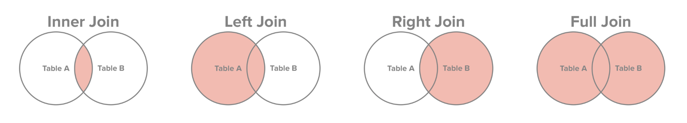

# SQL

- [./sqlcourse.md](./sqlcourse.md)

- JOIN types [http://www.sql-join.com/sql-join-types](http://www.sql-join.com/sql-join-types)



- UNION and UNION ALL [https://mode.com/sql-tutorial/sql-union/](https://mode.com/sql-tutorial/sql-union/) SQL joins allow you to combine two datasets side-by-side, but UNION allows you to stack one dataset on top of the other.
    * UNION Any rows in the appended table that are exactly identical to rows in the first table are dropped. 
    * UNION ALL appends all the values from the second table.
    * It there are no duplicate rows, so UNION ALL will produce the same results as UNION.

- OVER: window functions [https://mode.com/sql-tutorial/sql-window-functions/](https://mode.com/sql-tutorial/sql-window-functions/)

- CASE [https://mode.com/sql-tutorial/sql-case/](https://mode.com/sql-tutorial/sql-case/)

- ANY ALL [https://www.w3schools.com/sql/sql_any_all.asp](https://www.w3schools.com/sql/sql_any_all.asp)

- EXISTS [https://www.w3schools.com/sql/sql_exists.asp](https://www.w3schools.com/sql/sql_exists.asp)


- Other tips & resources:

```
SELECT A + ',' + B + ',' + C AS name
```

- [] w3 schools [https://www.w3schools.com/sql/](https://www.w3schools.com/sql/)
- [] Mode sql tutorial [https://mode.com/sql-tutorial/](https://mode.com/sql-tutorial/)
- [ ] Interview Practice [https://urldefense.proofpoint.com/v2/url?u=http-3A__www.programmerinterview.com_index...](https://urldefense.proofpoint.com/v2/url?u=http-3A__www.programmerinterview.com_index.php_database-2Dsql_practice-2Dinterview-2Dquestion-2D1_&d=DwMFaQ&c=5VD0RTtNlTh3ycd41b3MUw&r=lNYEIr-WW4ORZ7IEQXITqQ&m=t74O0k3s3GKq1vDTIy9G6Jjbkbz-j4LQBWgP0utUtMQ&s=FhCCf3MXCwGf9zqSQaA-lcfGwTTKlkiHkkCLGZ1Ct68&e=)
