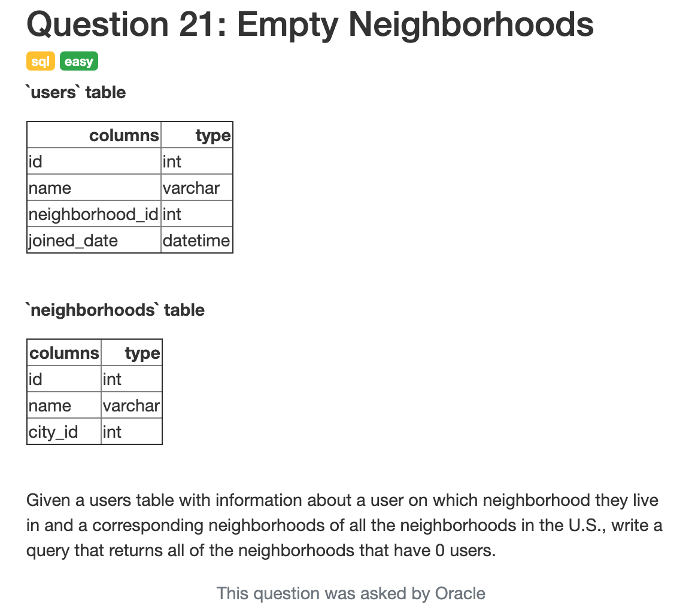
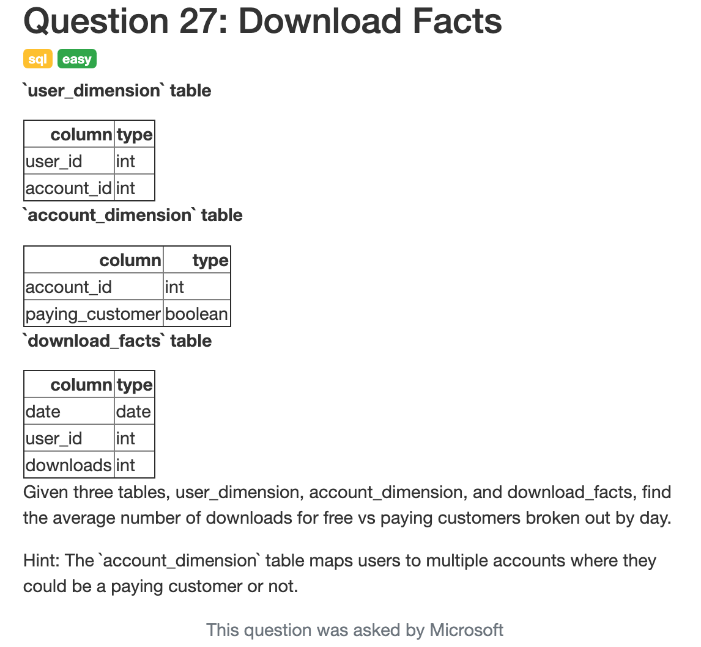
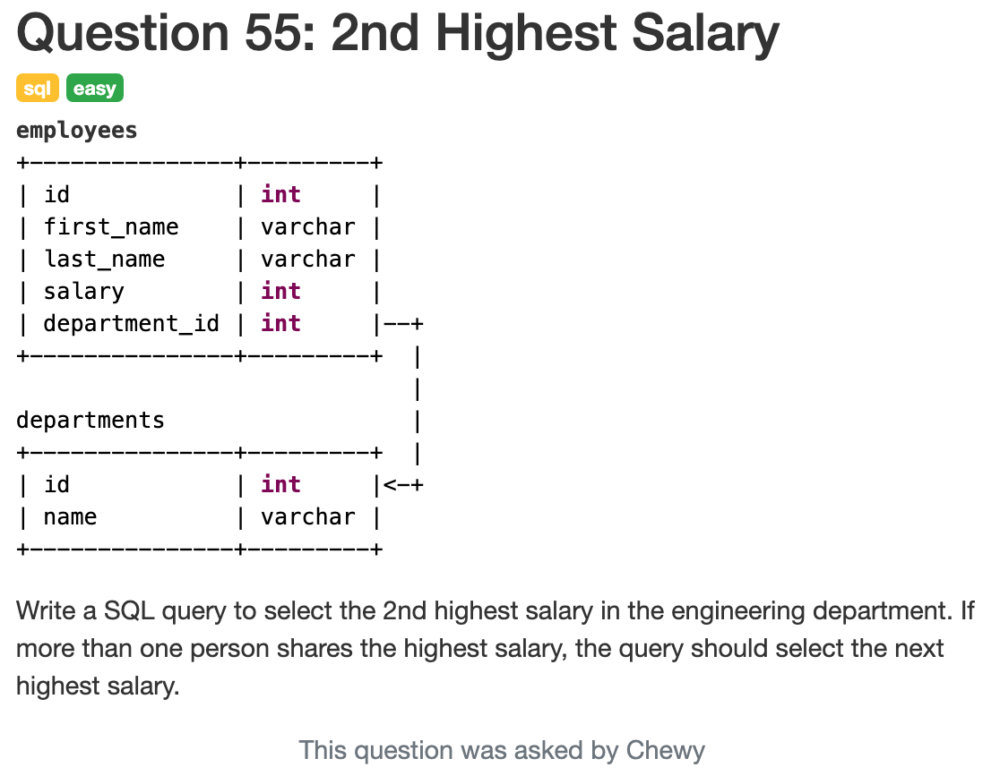
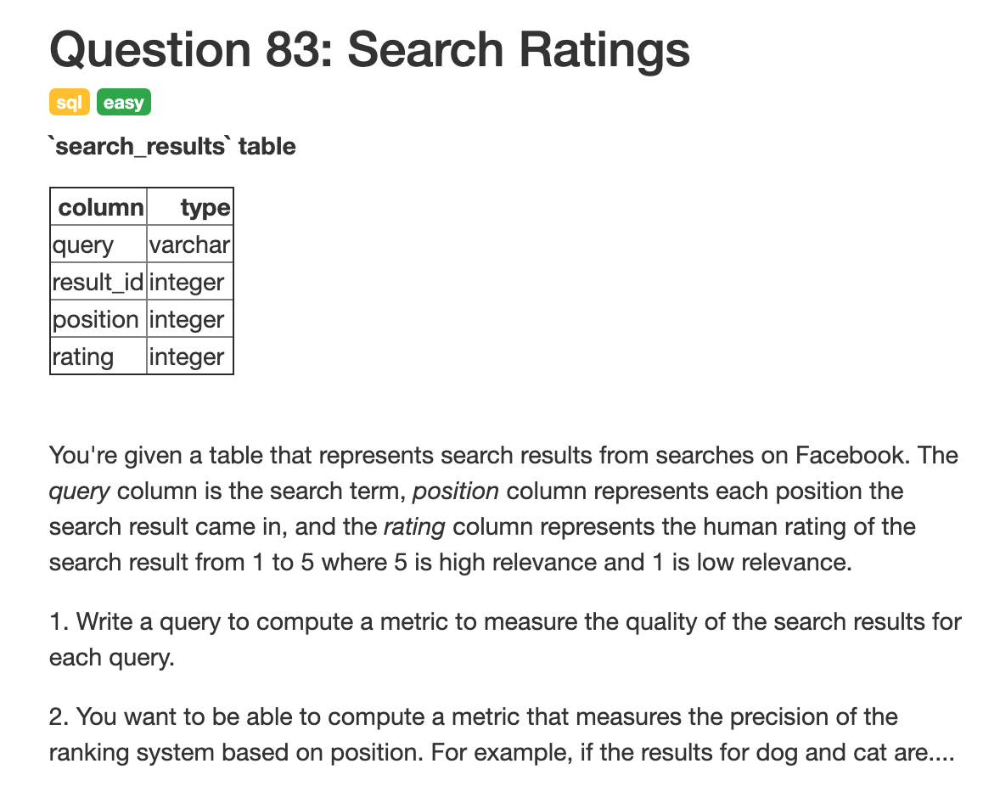
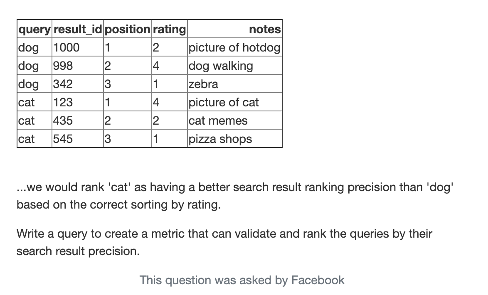
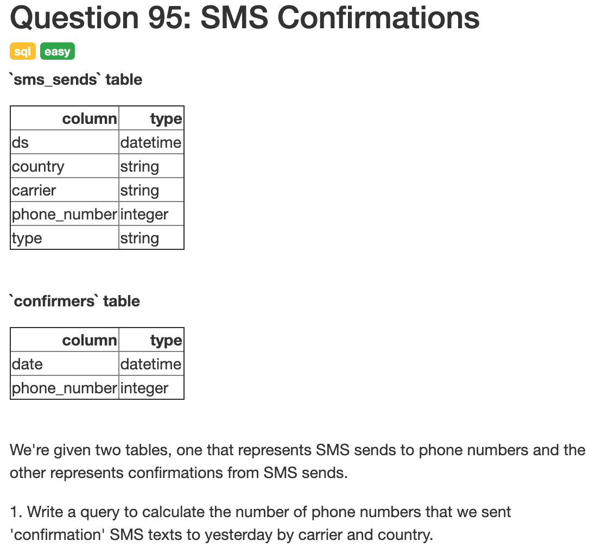
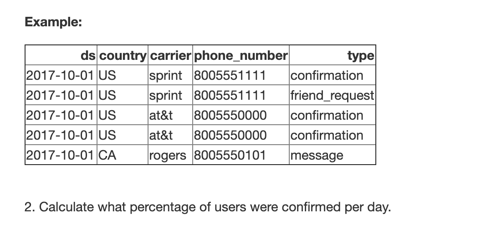
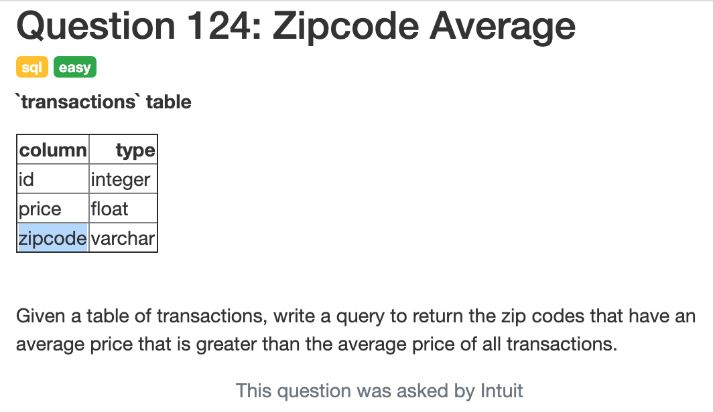
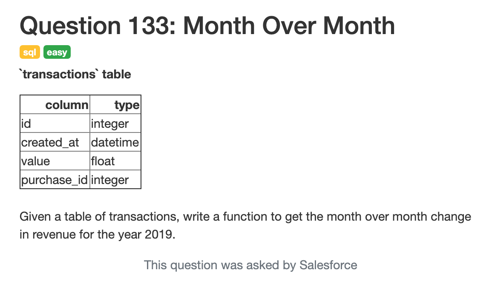

# interview_query

## Exercise 1 



```{sql}
SELECT n.name   
FROM neighborhoods AS n 
LEFT JOIN users AS u
    ON n.id = u.neighborhood_id
WHERE u.id IS NULL
```

```{sql}
SELECT name
FROM neighborhoods
WHERE id NOT IN (SELECT DISTINCT neighborhood_id FROM users)
```

## Exercise 2



```{sql}
SELECT a.paying_customer, d.date, sum(d.downloads) / count(DISTINCT user_id) as average_downloads
FROM user_dimension AS u 
JOIN account_dimension AS a ON u.account_id = a.account_id
JOIN download_facts AS d ON u.user_id AS d.user_id
GROUP BY a.paying_customer, d.date
```

## Exercise 3



```{sql}
SELECT salary LIMIT 1
FROM (SELECT DISTINCT employees as e JOIN departments as d on e.department_id = d.id 
WHERE d.id = 'engineering' AND salary < MAX(salary)
ORDER salary DESC)
WHERE salary < max(salary)

```

## Exercise 4



```{sql}
SELECT query, AVG(rating) as metric
FROM search_results
GROUP BY query
ORDER metric DESC
```



```{sql}
SELECT query, AVG(1 / position* rating) as metric
FROM search_results
GROUP BY query
ORDER metric DESC
```

## Exercise 5



```{sql}
SELECT carrier, country, count(phone_number)
WHERE type = "confirmation"
GROUP BY carrier, country
```



```{sql}
SELECT AS day, n_confirmed / n_users AS perc, count(s.phone_number) AS n_users, count(c.phone_number) AS n_confirmed
FROM sms_sends AS s LEFT JOIN confirmed AS c ON s.ds = c.date AND s.phone_number = c.phone_number
WHERE s.type = "confirmation"
GROUP BY day
```

## Exercise 6



```{sql}
WITH avg_price as (
  SELECT avg(price) as avg
  FROM transactions
)

WITH avg_zip_price  as (
  SELECT zipcode, avg(price) as avg
  FROM transactions
  GROUP BY zipcode
)

SELECT zipcode
FROM avg_price JOIN avg_zip_price on avg_zip_price.avg > avg_price.avg
```

## Exercise 7



```{sql}
WITH month_transactions AS (
SELECT 
  year(created_at) as year,
  month(created_at) as month, 
  sum(value) as revenue
FROM transactions
GROUP BY year, month
ORDER year, month)

SELECT mt1.month as month, mt1.revenue / mt0.revenue - 1 as revenue_change 
FROM month_transactions as mt1 OUTER JOIN month_transactions as mt0
   ON mt0.year = mt1.year AND mt0.month = (mt1.month - 1)
WHERE mt1.year = 2019
```


