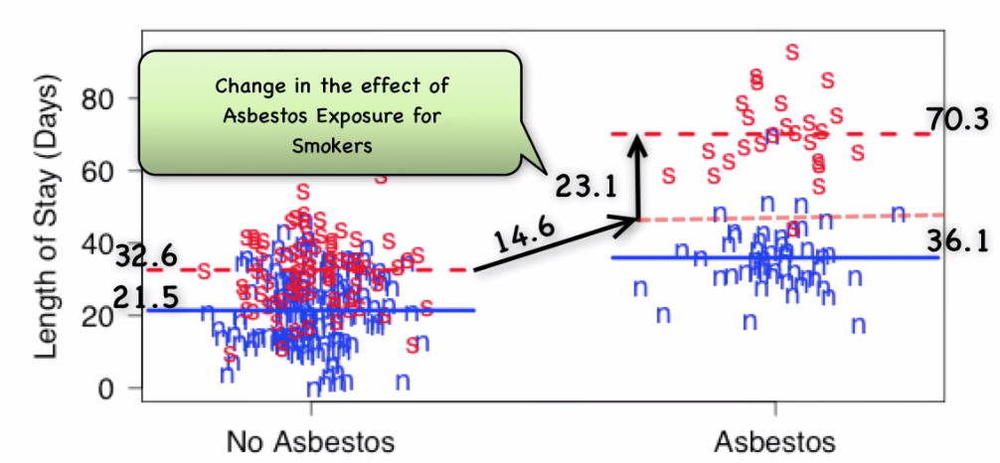
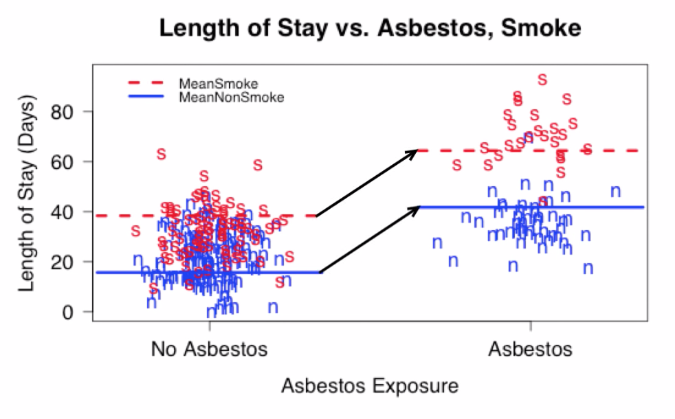

# stat-reasoning

## Linear Regression

### Interaction

- [ ] YouTube [Interpreting Interaction in Linear Regression](https://www.youtube.com/watch?v=vZUtDJbzFRQ)

* Concept of interaction
* Beta interpretation for two categorical variables with two levels each
* $Y$ length of stay in hospital
* $X_1$ smoking - binary
* $X_2$ asbestos exposure - binary
* **Interaction** - the effect of smoking depends on whether or not there is exposure to asbestos and the effect of asbestos exposure depends on smoking

* $b_0 = 21.5$ intersect term tells us the mean length of stay for the reference group (non-smokers and no exposure to asbestos occurs)
* $b_1 = 11.1 = 32.6 - 21.5$ the smoking effect for someone not exposed to asbestus
* $b_2 = 14.6 = 36.1 - 21.5$ the asbestus effect for non-smokers
* $b_3 = 23.1 = 70.3 - 14.6 - 32.6$ interaction effect of smoking when exposed to asbestus

* there must be a good reason to include an interaction term into the model
   - it should make sense conceptually
   - interaction term should be statistically significant

### Interpretation of $\beta$

* A direct interpretation of $\beta$ depends on how you worked your data. Were the columns standardized? Did data went through a pca transformation? So let's think of the simplest case where features are standardizd and features are not correlated. In this case, the $\beta$ is simply the correlation between each feature and the dependent variable weighted down by the variance of each feature...if a variable is highly correlated with the dependent variable but has high variance then...

### Logistic regression

- [ ] [logistic regression](https://towardsdatascience.com/logit-of-logistic-regression-understanding-the-fundamentals-f384152a33d1)

## Hypothesis Test

- [ ] [Wikipedia](https://en.wikipedia.org/wiki/P-value)

 * every conjecture concerning the unknown distribution F of a random variable X is called a **statistical hypothesis**. 
 * Methods of verifying statistical hypotheses are called **statistical tests**
 * **significance test** a statistical test to verify whether the hypothesis is not false
 * **parametric hypothesis** a statistical hypothesis that refers only to the numerical values of unknown parameters of a distribution
 * Tests of parametric hypotheses are called **parametric tests** 
 * We can likewise also have non-parametric hypotheses and non-parametric tests

## p-value

* Probability that random chance generated the value or something rarer [1](https://www.youtube.com/watch?v=5Z9OIYA8He8&feature=emb_rel_pause)
* The p-value is used in the context of null hypothesis testing in order to quantify the idea of statistical significance of evidence, a claim is assumed valid if its counter-claim is improbable [2](https://en.wikipedia.org/wiki/P-value)
* If the p-value is less than your significance level, you can reject the null and conclude that the effect is statistically significant. In other words, the evidence in your sample is strong enough to be able to reject the null hypothesis at the population level [3](https://statisticsbyjim.com/hypothesis-testing/statistical-hypothesis-testing-overview/)

## types of errors

- [ ] [https://www.youtube.com/user/joshstarmer](https://www.youtube.com/user/joshstarmer)